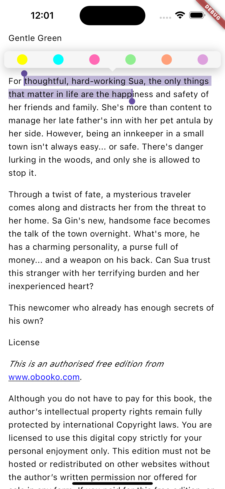
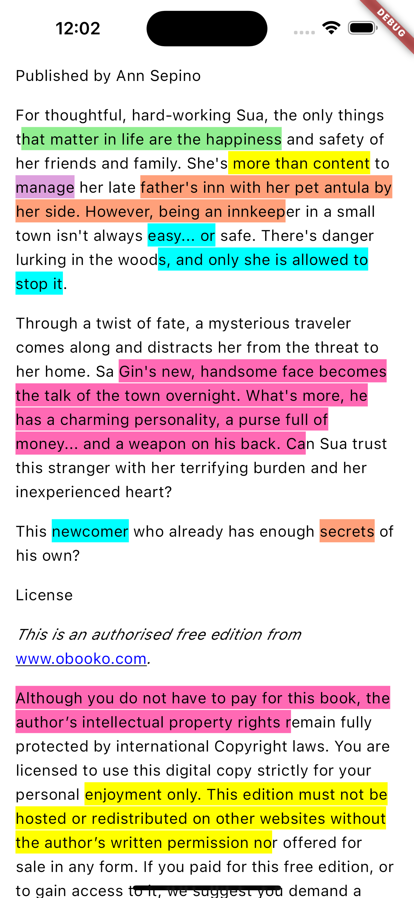
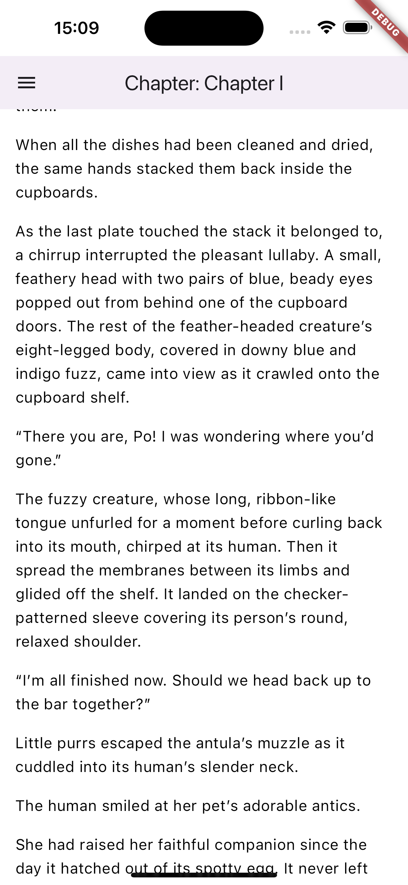
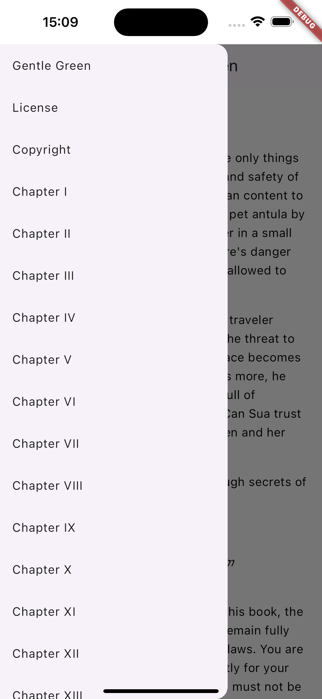
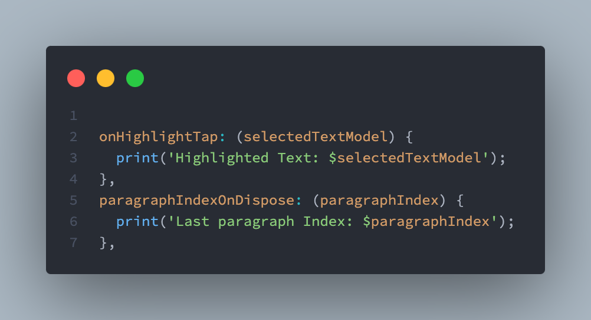

# EPub Reader Highlight

[](https://github.com/danielmaques/epub_reader_highlight)

## Table of Contents

- [Description](#description)
- [Features](#features)
- [Screenshots](#screenshots)
  - [Text Highlight](#text-highlight)
  - [Chapter List](#chapter-list)
  - [Highlight Management](#highlight-management)
- [Usage](#usage)
  - [Installation](#installation)
  - [Usage Examples](#usage-examples)
- [Contributing](#contributing)
- [Acknowledgements](#acknowledgements)
- [License](#license)

## Description

EPub Reader Highlight is a Flutter application that offers a complete solution for reading books in the Epub format. With an intuitive interface and advanced features, this tool allows developers to create personalized and efficient reading experiences for their users.

## Features

- **Text Highlight:** Select important excerpts from the book and apply different highlight colors to facilitate review and organization of the content.
- **Chapter List:** Easily navigate between the book's chapters, viewing the title and number of each one.
- **Highlight Management:** Access an organized list of all added highlights, with the option to filter by color or chapter.
- **Customizable Interface:** Adapt the reader's appearance to your preferences, with options to adjust font size, line spacing, and reading mode.
- **Last Paragraph Access:** Access the last paragraph read in the book and manage the text selected for highlights, allowing developers to save and manage the reading progress and selected text as desired.

## Screenshots

Here are some screenshots of EPub Reader Highlight in action:

### Text Highlight

<p>
    
    
</p>

### Chapter List

<p>
    
    
</p>

### Highlight Management



## Usage

### Installation

1. Clone the repository:
   ```sh
   git clone https://github.com/danielmaques/epub_reader_highlight.git
   ```
2. Navigate to the project directory:
   ```sh
   cd epub_reader_highlight
   ```
3. Install the dependencies:
   ```sh
   flutter pub get
   ```
4. Run the application:
   ```sh
   flutter run
   ```

### Usage Examples

```dart
class _MainAppState extends State<MainApp> {
  late EpubController _epubReaderController;

  @override
  void initState() {
    super.initState();

    /// Assets
    /// EpubDocument.openAsset('assets/gentle-green-obooko.epub')
    /// EpubDocument.openFile(path)

    _epubReaderController = EpubController(
      document: EpubDocument.openAsset('assets/gentle-green-obooko.epub'),
    );

    _epubReaderController = EpubController(
      document: EpubDocument.,
    );
  }

  @override
  Widget build(BuildContext context) {
    return MaterialApp(
      home: Container(
        color: Colors.white,
        child: SafeArea(
          bottom: false,
          child: Scaffold(
            backgroundColor: Colors.white,
            appBar: AppBar(
              title: EpubViewActualChapter(
                controller: _epubReaderController,
                builder: (chapterValue) => Text(
                  'Chapter: ${chapterValue?.chapter?.Title?.replaceAll('\n', '').trim() ?? ''}',
                  textAlign: TextAlign.start,
                ),
              ),
            ),
            drawer: Drawer(
              child: EpubViewTableOfContents(
                controller: _epubReaderController,
              ),
            ),
            body: EpubView(
              builders: EpubViewBuilders<DefaultBuilderOptions>(
                options: const DefaultBuilderOptions(
                  textStyle: TextStyle(),
                ),
                chapterDividerBuilder: (_) => Container(),
              ),
              controller: _epubReaderController,
            ),
          ),
        ),
      ),
    );
  }
}
```

- **Text Highlight:** To highlight a section, simply select the desired text and choose a highlight color.
- **Chapter Navigation:** Use the chapter menu to easily navigate through the book.

```dart
    EpubViewTableOfContents(
        controller: _epubReaderController,
    ),
```
- **Interface Customization:** Access the app settings to adjust the font, spacing, and reading mode.
- **Last Paragraph Access:** 
```dart

    onHighlightTap: (selectedTextModel) {
        print('Highlighted Text: $selectedTextModel');
    },
    paragraphIndexOnDispose: (paragraphIndex) {
        print('Last paragraph Index: $paragraphIndex');
    },
```

## Contributing

Contributions are what make the open source community such an amazing place to learn, inspire, and create. Any contributions you make are **greatly appreciated**.

If you have a suggestion to improve this project, please fork the repository and create a pull request. You can also simply open an issue with the appropriate tag. Don't forget to give the project a star! Thank you very much!

1. Fork the Project
2. Create your Feature Branch (`git checkout -b feature/AmazingFeature`)
3. Commit your Changes (`git commit -m 'Add some AmazingFeature'`)
4. Push to the Branch (`git push origin feature/AmazingFeature`)
5. Open a Pull Request

Be sure to include a tag and follow [Conventional Commits](https://www.conventionalcommits.org/en/v1.0.0/) and [Semantic Versioning](https://semver.org/) when submitting your commit and/or creating the issue.

## Acknowledgements

Thanks to all the people who have contributed to this project. Without you, this project would not be possible.

<a href="https://github.com/danielmaques/epub_reader_highlight/graphs/contributors">
  
</a>

## License

This project is licensed under the [MIT License](LICENSE).